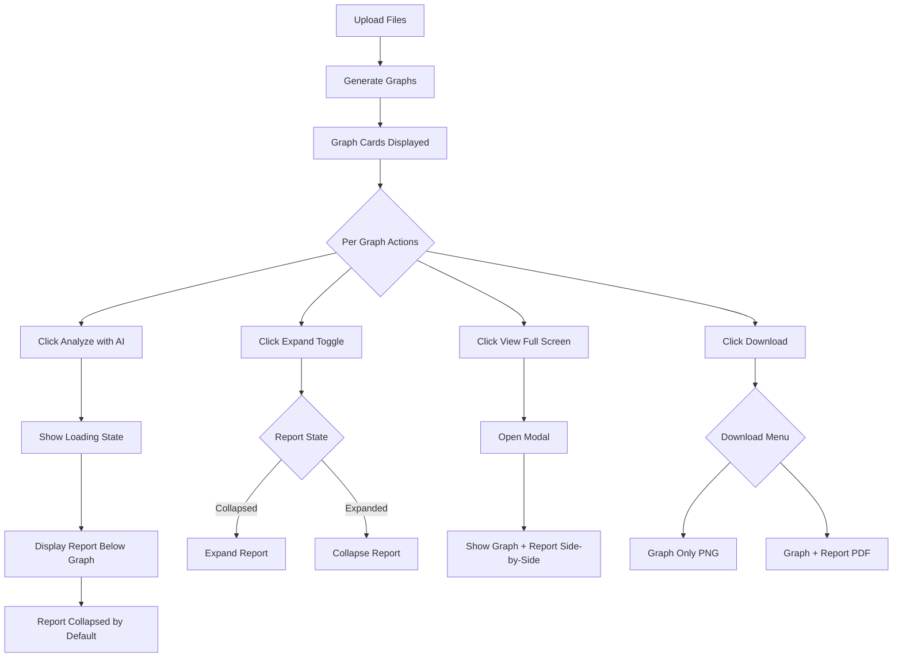

# Per-Graph AI Interpretation Feature - Technical Architecture

## Executive Summary

This document outlines the architecture for migrating from a global AI interpretation system to a per-graph AI interpretation feature, where each spectral comparison graph has its own AI analysis, download options, and viewing capabilities.

---

## 1. State Management Design

### 1.1 New Data Structures

```typescript
// Extended graph interface with AI interpretation
interface GraphWithInterpretation {
  // Graph data
  id: string;
  sampleName: string;
  sampleFileId: string;
  data: string; // base64 image data
  
  // AI interpretation state
  interpretation: InterpretationReport | null;
  interpretationLoading: boolean;
  interpretationError: string | null;
  
  // UI state
  reportExpanded: boolean;
  modalOpen: boolean;
}

// Interpretation status tracking
interface InterpretationState {
  [graphId: string]: {
    status: 'idle' | 'loading' | 'success' | 'error';
    report: InterpretationReport | null;
    error: string | null;
    timestamp: number;
  };
}
```

### 1.2 State Migration Plan

**FROM (Current):**
```typescript
const [interpretationReport, setInterpretationReport] = useState<any>(null)
const [graphImages, setGraphImages] = useState<Array<{id: string, data: string, sampleName: string}>>([])
```

**TO (New):**
```typescript
const [graphs, setGraphs] = useState<GraphWithInterpretation[]>([])
const [interpretationStates, setInterpretationStates] = useState<InterpretationState>({})
```

### 1.3 State Management Rationale

**Why use a separate `interpretationStates` map?**
- Allows atomic updates to individual graph interpretations
- Prevents re-rendering all graphs when one interpretation completes
- Easy to track loading/error states per graph
- Simplifies cleanup and memory management

---

## 2. Component Structure

### 2.1 Component Hierarchy

```
Dashboard
├── FileUploadSection (existing)
├── ActionButtons (modified - remove global "Analyze with AI")
├── NormalizationResults (existing)
└── GraphGallery (new wrapper component)
    └── GraphCard (new component) × N
        ├── GraphCardHeader
        │   ├── Title
        │   └── ActionButtons
        │       ├── AnalyzeButton
        │       ├── ExpandButton
        │       └── DownloadMenu
        ├── GraphImage
        ├── InterpretationReport (collapsible)
        │   ├── CollapseToggle
        │   └── ReportContent
        └── GraphCardModal (when expanded)
```

### 2.2 New Components

#### **GraphCard Component**

```typescript
// spectral-analyzer-web/frontend/src/components/GraphCard.tsx

import { useState, useRef } from 'react';
import {
  Card,
  CardContent,
  Box,
  Typography,
  Button,
  IconButton,
  Menu,
  MenuItem,
  Collapse,
  CircularProgress,
  Alert,
  Stack,
  Divider
} from '@mui/material';
import {
  ScienceIcon,
  ExpandIcon,
  DownloadIcon,
  KeyboardArrowDownIcon,
  KeyboardArrowUpIcon
} from '@mui/icons-material';
import { GraphWithInterpretation } from '../types';
import InterpretationReportView from './InterpretationReportView';

interface GraphCardProps {
  graph: GraphWithInterpretation;
  baselineFileId: string;
  onAnalyze: (graphId: string) => Promise<void>;
  onDownloadGraph: (graphId: string) => void;
  onDownloadWithReport: (graphId: string) => void;
  onExpandView: (graphId: string) => void;
  onToggleReport: (graphId: string) => void;
}

export const GraphCard: React.FC<GraphCardProps> = ({
  graph,
  baselineFileId,
  onAnalyze,
  onDownloadGraph,
  onDownloadWithReport,
  onExpandView,
  onToggleReport
}) => {
  const [downloadMenuAnchor, setDownloadMenuAnchor] = useState<null | HTMLElement>(null);
  const graphRef = useRef<HTMLDivElement>(null);

  const hasInterpretation = !!graph.interpretation;
  const isLoading = graph.interpretationLoading;
  const hasError = !!graph.interpretationError;

  return (
    <Card sx={{ 
      background: 'rgba(30, 41, 59, 0.7)',
      backdropFilter: 'blur(10px)',
      border: '1px solid rgba(148, 163, 184, 0.1)',
      height: '100%',
      display: 'flex',
      flexDirection: 'column'
    }}>
      <CardContent sx={{ flexGrow: 1, display: 'flex', flexDirection: 'column' }}>
        {/* Header with actions */}
        <Stack 
          direction="row" 
          justifyContent="space-between" 
          alignItems="center" 
          sx={{ mb: 2 }}
        >
          <Typography variant="h6" sx={{ fontWeight: 600 }}>
            {graph.sampleName}
          </Typography>
          
          <Stack direction="row" spacing={1}>
            {/* Analyze with AI button */}
            {!hasInterpretation && !isLoading && (
              <Button
                variant="outlined"
                size="small"
                startIcon={<ScienceIcon />}
                onClick={() => onAnalyze(graph.id)}
                sx={{
                  borderColor: 'rgba(244, 114, 182, 0.5)',
                  color: '#f472b6',
                  '&:hover': {
                    borderColor: '#f472b6',
                    background: 'rgba(244, 114, 182, 0.1)'
                  }
                }}
              >
                Analyze with AI
              </Button>
            )}
            
            {/* Loading indicator */}
            {isLoading && (
              <Box sx={{ display: 'flex', alignItems: 'center', gap: 1 }}>
                <CircularProgress size={20} />
                <Typography variant="body2" color="text.secondary">
                  Analyzing...
                </Typography>
              </Box>
            )}
            
            {/* Expand button */}
            <IconButton 
              size="small" 
              onClick={() => onExpandView(graph.id)}
              title="View Full Screen"
            >
              <ExpandIcon />
            </IconButton>
            
            {/* Download menu */}
            <IconButton
              size="small"
              onClick={(e) => setDownloadMenuAnchor(e.currentTarget)}
              title="Download Options"
            >
              <DownloadIcon />
            </IconButton>
            
            <Menu
              anchorEl={downloadMenuAnchor}
              open={Boolean(downloadMenuAnchor)}
              onClose={() => setDownloadMenuAnchor(null)}
            >
              <MenuItem onClick={() => {
                onDownloadGraph(graph.id);
                setDownloadMenuAnchor(null);
              }}>
                Download Graph Only (PNG)
              </MenuItem>
              <MenuItem 
                onClick={() => {
                  onDownloadWithReport(graph.id);
                  setDownloadMenuAnchor(null);
                }}
                disabled={!hasInterpretation}
              >
                Download with Report (PDF)
              </MenuItem>
            </Menu>
          </Stack>
        </Stack>

        <Divider sx={{ mb: 2 }} />

        {/* Graph Image */}
        <Box
          ref={graphRef}
          sx={{
            textAlign: 'center',
            background: 'white',
            borderRadius: 2,
            p: 1,
            mb: 2,
            '& img': {
              maxWidth: '100%',
              height: 'auto',
              borderRadius: 1
            }
          }}
        >
          
        </Box>

        {/* Interpretation Report Section */}
        {hasError && (
          <Alert severity="error" sx={{ mb: 2 }}>
            {graph.interpretationError}
          </Alert>
        )}

        {hasInterpretation && (
          <>
            <Stack 
              direction="row" 
              justifyContent="space-between" 
              alignItems="center"
              sx={{ 
                cursor: 'pointer',
                p: 1,
                borderRadius: 1,
                '&:hover': { background: 'rgba(255, 255, 255, 0.05)' }
              }}
              onClick={() => onToggleReport(graph.id)}
            >
              <Typography variant="subtitle1" sx={{ fontWeight: 600 }}>
                AI Interpretation Report
              </Typography>
              <IconButton size="small">
                {graph.reportExpanded ? <KeyboardArrowUpIcon /> : <KeyboardArrowDownIcon />}
              </IconButton>
            </Stack>

            <Collapse in={graph.reportExpanded}>
              <Box sx={{ mt: 2 }}>
                <InterpretationReportView report={graph.interpretation!} />
              </Box>
            </Collapse>
          </>
        )}
      </CardContent>
    </Card>
  );
};
```

#### **InterpretationReportView Component**

```typescript
// spectral-analyzer-web/frontend/src/components/InterpretationReportView.tsx

import { InterpretationReport } from '../services/api';
import { 
  Box, 
  Grid, 
  Paper, 
  Typography, 
  Alert, 
  Chip,
  Stack 
} from '@mui/material';

interface InterpretationReportViewProps {
  report: InterpretationReport;
  compact?: boolean; // for collapsed view vs modal view
}

export const InterpretationReportView: React.FC<InterpretationReportViewProps> = ({ 
  report, 
  compact = false 
}) => {
  // Reuse existing interpretation report rendering logic from Dashboard.tsx
  // This component extracts lines 634-913 from Dashboard.tsx
  // ... (implementation follows the same structure)
};
```

#### **GraphCardModal Component**

```typescript
// spectral-analyzer-web/frontend/src/components/GraphCardModal.tsx

import {
  Dialog,
  DialogTitle,
  DialogContent,
  DialogActions,
  Button,
  Box,
  IconButton
} from '@mui/material';
import CloseIcon from '@mui/icons-material/Close';
import { GraphWithInterpretation } from '../types';
import { InterpretationReportView } from './InterpretationReportView';

interface GraphCardModalProps {
  graph: GraphWithInterpretation | null;
  open: boolean;
  onClose: () => void;
  onDownloadGraph: (graphId: string) => void;
  onDownloadWithReport: (graphId: string) => void;
}

export const GraphCardModal: React.FC<GraphCardModalProps> = ({
  graph,
  open,
  onClose,
  onDownloadGraph,
  onDownloadWithReport
}) => {
  if (!graph) return null;

  return (
    <Dialog
      open={open}
      onClose={onClose}
      maxWidth="xl"
      fullWidth
      PaperProps={{
        sx: {
          background: 'rgba(15, 23, 42, 0.95)',
          backdropFilter: 'blur(10px)',
          minHeight: '90vh'
        }
      }}
    >
      <DialogTitle sx={{ display: 'flex', justifyContent: 'space-between', alignItems: 'center' }}>
        <Typography variant="h5">{graph.sampleName} - Full View</Typography>
        <IconButton onClick={onClose}>
          <CloseIcon />
        </IconButton>
      </DialogTitle>

      <DialogContent sx={{ p: 3 }}>
        <Grid container spacing={3}>
          {/* Graph on left/top */}
          <Grid item xs={12} lg={6}>
            <Box
              sx={{
                background: 'white',
                borderRadius: 2,
                p: 2,
                '& img': {
                  width: '100%',
                  height: 'auto'
                }
              }}
            >
              
            </Box>
          </Grid>

          {/* Report on right/bottom */}
          <Grid item xs={12} lg={6}>
            {graph.interpretation ? (
              <InterpretationReportView report={graph.interpretation} />
            ) : (
              <Alert severity="info">
                No interpretation available. Click "Analyze with AI" to generate a report.
              </Alert>
            )}
          </Grid>
        </Grid>
      </DialogContent>

      <DialogActions>
        <Button onClick={() => onDownloadGraph(graph.id)}>
          Download Graph (PNG)
        </Button>
        <Button
          onClick={() => onDownloadWithReport(graph.id)}
          disabled={!graph.interpretation}
          variant="contained"
        >
          Download with Report (PDF)
        </Button>
        <Button onClick={onClose}>Close</Button>
      </DialogActions>
    </Dialog>
  );
};
```

---

## 3. Download Implementation

### 3.1 Download Graph Only (PNG)

**Current Implementation (Keep):**
```typescript
const handleDownloadGraph = (graphId: string) => {
  const graph = graphs.find(g => g.id === graphId);
  if (!graph) return;
  
  const link = document.createElement('a');
  link.href = graph.data; // base64 data
  link.download = `${graph.sampleName}_${Date.now()}.png`;
  document.body.appendChild(link);
  link.click();
  document.body.removeChild(link);
  toast.success('Graph downloaded!');
};
```

### 3.2 Download with Report (PDF)

**Implementation Strategy: html2canvas + jsPDF**

```typescript
import html2canvas from 'html2canvas';
import jsPDF from 'jspdf';

const handleDownloadWithReport = async (graphId: string) => {
  const graph = graphs.find(g => g.id === graphId);
  if (!graph || !graph.interpretation) {
    toast.error('No interpretation available');
    return;
  }

  try {
    toast.loading('Generating PDF...', { id: 'pdf' });

    // Create a temporary container with graph + report
    const container = document.createElement('div');
    container.style.position = 'absolute';
    container.style.left = '-9999px';
    container.style.width = '210mm'; // A4 width
    container.style.padding = '20px';
    container.style.background = 'white';
    container.style.color = 'black';
    
    // Add graph image
    const graphImg = document.createElement('img');
    graphImg.src = graph.data;
    graphImg.style.width = '100%';
    graphImg.style.marginBottom = '20px';
    container.appendChild(graphImg);
    
    // Add report header
    const header = document.createElement('h2');
    header.textContent = `AI Interpretation Report - ${graph.sampleName}`;
    header.style.marginBottom = '20px';
    header.style.borderBottom = '2px solid #333';
    header.style.paddingBottom = '10px';
    container.appendChild(header);
    
    // Add report content
    const reportDiv = createReportHTML(graph.interpretation);
    container.appendChild(reportDiv);
    
    // Add timestamp
    const timestamp = document.createElement('p');
    timestamp.textContent = `Generated: ${new Date().toLocaleString()}`;
    timestamp.style.marginTop = '20px';
    timestamp.style.fontSize = '12px';
    timestamp.style.color = '#666';
    container.appendChild(timestamp);
    
    document.body.appendChild(container);

    // Wait for images to load
    await new Promise(resolve => {
      if (graphImg.complete) {
        resolve(null);
      } else {
        graphImg.onload = () => resolve(null);
      }
    });

    // Capture as canvas
    const canvas = await html2canvas(container, {
      scale: 2,
      useCORS: true,
      backgroundColor: '#ffffff'
    });

    // Create PDF
    const pdf = new jsPDF({
      orientation: 'portrait',
      unit: 'mm',
      format: 'a4'
    });

    const imgWidth = 210; // A4 width in mm
    const imgHeight = (canvas.height * imgWidth) / canvas.width;
    const imgData = canvas.toDataURL('image/png');

    let heightLeft = imgHeight;
    let position = 0;

    // Add first page
    pdf.addImage(imgData, 'PNG', 0, position, imgWidth, imgHeight);
    heightLeft -= 297; // A4 height in mm

    // Add additional pages if needed
    while (heightLeft > 0) {
      position = heightLeft - imgHeight;
      pdf.addPage();
      pdf.addImage(imgData, 'PNG', 0, position, imgWidth, imgHeight);
      heightLeft -= 297;
    }

    // Download
    pdf.save(`${graph.sampleName}_with_report_${Date.now()}.pdf`);

    // Cleanup
    document.body.removeChild(container);
    
    toast.success('PDF downloaded!', { id: 'pdf' });
  } catch (error) {
    console.error('PDF generation error:', error);
    toast.error('Failed to generate PDF', { id: 'pdf' });
  }
};

// Helper to create structured HTML from interpretation
const createReportHTML = (interpretation: any): HTMLDivElement => {
  const div = document.createElement('div');
  div.style.fontFamily = 'Arial, sans-serif';
  div.style.fontSize = '14px';
  div.style.lineHeight = '1.6';
  
  // Add sections based on interpretation structure
  // ... (implementation details)
  
  return div;
};
```

### 3.3 Required Dependencies

```json
{
  "dependencies": {
    "html2canvas": "^1.4.1",
    "jspdf": "^2.5.1"
  }
}
```

---

## 4. User Flow

### 4.1 Main User Flow



### 4.2 Detailed State Transitions

**State 1: Initial Graph Display**
- Graph card shows image
- "Analyze with AI" button visible
- No report section
- Download menu shows "Graph Only" (enabled), "With Report" (disabled)

**State 2: Analysis Loading**
- "Analyze with AI" button replaced with loading spinner
- Graph remains visible
- Status text "Analyzing..." shown

**State 3: Analysis Complete**
- Loading spinner removed
- Report section appears below graph
- Report initially collapsed (shows title bar with expand/collapse icon)
- Download menu shows both options enabled

**State 4: Report Expanded**
- Report content fully visible
- Collapse icon shows up arrow
- Scroll bar appears if report is long

**State 5: Modal View**
- Full-screen dialog opens
- Graph on left (or top on mobile)
- Report on right (or bottom on mobile)
- Download buttons in footer

---

## 5. Implementation Roadmap

### Phase 1: Data Model & State (2-3 hours)

1. Create new TypeScript interfaces
2. Migrate state from global to per-graph
3. Update graph generation to include full graph object
4. Test state transitions

### Phase 2: Component Extraction (3-4 hours)

1. Create `GraphCard` component
2. Create `InterpretationReportView` component
3. Extract interpretation rendering logic
4. Test component isolation

### Phase 3: Per-Graph AI Integration (2-3 hours)

1. Implement per-graph analyze handler
2. Update API calls to work per-graph
3. Implement loading states per card
4. Add error handling per graph

### Phase 4: UI Enhancements (2-3 hours)

1. Implement collapse/expand toggle
2. Create modal/full-screen view
3. Add animations and transitions
4. Responsive design adjustments

### Phase 5: Download Features (3-4 hours)

1. Integrate html2canvas and jsPDF
2. Implement PDF generation logic
3. Create structured report HTML
4. Test download functionality
5. Add loading states for PDF generation

### Phase 6: Testing & Polish (2-3 hours)

1. Test multi-graph scenarios
2. Test error states
3. Performance optimization
4. Accessibility improvements
5. Documentation

**Total Estimated Time: 14-20 hours**

---

## 6. Code Examples

### 6.1 Updated Dashboard.tsx (Key Changes)

```typescript
const Dashboard = () => {
  // OLD STATE (Remove)
  // const [interpretationReport, setInterpretationReport] = useState<any>(null)
  // const [graphImages, setGraphImages] = useState<Array<{id: string, data: string, sampleName: string}>>([])
  
  // NEW STATE
  const [graphs, setGraphs] = useState<GraphWithInterpretation[]>([])
  const [expandedGraphId, setExpandedGraphId] = useState<string | null>(null)

  // Generate graphs - update to new structure
  const handleGenerateGraph = async () => {
    if (!baselineFile || sampleFiles.length === 0) {
      toast.error('Please upload baseline and sample files first')
      return
    }

    setGeneratingGraph(true)
    setGraphs([]) // Clear existing graphs
    
    try {
      toast.loading(`Generating ${sampleFiles.length} comparison graph(s)...`, { id: 'graph' })
      
      const newGraphs: GraphWithInterpretation[] = []
      
      for (const sampleFile of sampleFiles) {
        try {
          const result = await generateGraph(baselineFile.file_id, sampleFile.file_id, 'png')
          newGraphs.push({
            id: result.graph_id,
            sampleName: sampleFile.filename,
            sampleFileId: sampleFile.file_id,
            data: result.graph_data,
            interpretation: null,
            interpretationLoading: false,
            interpretationError: null,
            reportExpanded: false,
            modalOpen: false
          })
        } catch (error: any) {
          toast.error(`Failed to generate graph for ${sampleFile.filename}`)
        }
      }
      
      setGraphs(newGraphs)
      toast.success(`Successfully generated ${newGraphs.length} graph(s)!`, { id: 'graph' })
      loadStats()
    } catch (error: any) {
      toast.error(`Graph generation failed: ${error.response?.data?.detail || error.message}`, { id: 'graph' })
    } finally {
      setGeneratingGraph(false)
    }
  }

  // Per-graph analyze handler
  const handleAnalyzeGraph = async (graphId: string) => {
    const graph = graphs.find(g => g.id === graphId)
    if (!graph) return

    // Update loading state for this specific graph
    setGraphs(prev => prev.map(g => 
      g.id === graphId 
        ? { ...g, interpretationLoading: true, interpretationError: null }
        : g
    ))

    try {
      const interpretation = await interpretSpectralData(graph.sampleFileId)
      
      if (!interpretation || !interpretation.interpretation) {
        throw new Error('Invalid interpretation data')
      }

      // Update graph with interpretation
      setGraphs(prev => prev.map(g => 
        g.id === graphId 
          ? { 
              ...g, 
              interpretation: interpretation.interpretation,
              interpretationLoading: false,
              reportExpanded: true // Auto-expand on first load
            }
          : g
      ))

      toast.success('AI analysis complete!')
    } catch (error: any) {
      setGraphs(prev => prev.map(g => 
        g.id === graphId 
          ? { 
              ...g, 
              interpretationLoading: false,
              interpretationError: error.response?.data?.detail || error.message
            }
          : g
      ))
      toast.error('AI analysis failed')
    }
  }

  // Toggle report expansion
  const handleToggleReport = (graphId: string) => {
    setGraphs(prev => prev.map(g => 
      g.id === graphId 
        ? { ...g, reportExpanded: !g.reportExpanded }
        : g
    ))
  }

  // Open modal view
  const handleExpandView = (graphId: string) => {
    setExpandedGraphId(graphId)
  }

  return (
    <Box>
      {/* ... existing upload section ... */}
      
      {/* REMOVE global "Analyze with AI" button */}
      
      {/* Action Buttons - only Generate Graph */}
      <Box sx={{ mb: 4, display: 'flex', gap: 2, justifyContent: 'center' }}>
        <Button
          variant="contained"
          size="large"
          startIcon={<ShowChartIcon />}
          onClick={handleGenerateGraph}
          disabled={!baselineFile || sampleFiles.length === 0 || generatingGraph}
        >
          {generatingGraph ? 'Generating...' : 'Generate Graphs'}
        </Button>
      </Box>

      {/* Graph Gallery with per-graph AI */}
      {graphs.length > 0 && (
        <Box sx={{ mb: 4 }}>
          <Typography variant="h5" sx={{ mb: 3 }}>
            Spectral Comparison Graphs ({graphs.length})
          </Typography>
          
          <Grid container spacing={3}>
            {graphs.map((graph) => (
              <Grid item xs={12} md={graphs.length === 1 ? 12 : 6} key={graph.id}>
                <GraphCard
                  graph={graph}
                  baselineFileId={baselineFile!.file_id}
                  onAnalyze={handleAnalyzeGraph}
                  onDownloadGraph={handleDownloadGraph}
                  onDownloadWithReport={handleDownloadWithReport}
                  onExpandView={handleExpandView}
                  onToggleReport={handleToggleReport}
                />
              </Grid>
            ))}
          </Grid>
        </Box>
      )}

      {/* Modal for expanded view */}
      <GraphCardModal
        graph={graphs.find(g => g.id === expandedGraphId) || null}
        open={!!expandedGraphId}
        onClose={() => setExpandedGraphId(null)}
        onDownloadGraph={handleDownloadGraph}
        onDownloadWithReport={handleDownloadWithReport}
      />
    </Box>
  )
}
```

---

## 7. Performance Considerations

### 7.1 Optimization Strategies

1. **Lazy Report Rendering**: Only render interpretation content when expanded
2. **Memoization**: Use `React.memo` for GraphCard to prevent unnecessary re-renders
3. **Virtual Scrolling**: Consider react-window for many graphs (>10)
4. **Image Optimization**: Compress base64 images if size becomes an issue
5. **Concurrent AI Requests**: Limit simultaneous interpretation requests to 2-3

### 7.2 Memory Management

```typescript
// Cleanup when unmounting
useEffect(() => {
  return () => {
    // Revoke blob URLs if using them
    graphs.forEach(graph => {
      if (graph.data.startsWith('blob:')) {
        URL.revokeObjectURL(graph.data);
      }
    });
  };
}, [graphs]);
```

---

## 8. Accessibility

### 8.1 ARIA Labels

```typescript
<Button
  aria-label={`Analyze ${graph.sampleName} with AI`}
  aria-busy={graph.interpretationLoading}
>
  Analyze with AI
</Button>

<IconButton
  aria-label={graph.reportExpanded ? "Collapse report" : "Expand report"}
  aria-expanded={graph.reportExpanded}
>
  {graph.reportExpanded ? <KeyboardArrowUpIcon /> : <KeyboardArrowDownIcon />}
</IconButton>
```

### 8.2 Keyboard Navigation

- All buttons must be keyboard accessible
- Modal should trap focus
- Escape key closes modal
- Tab order should be logical

---

## 9. Testing Strategy

### 9.1 Unit Tests

```typescript
describe('GraphCard', () => {
  it('shows analyze button when no interpretation', () => {
    // Test
  });
  
  it('shows loading state during analysis', () => {
    // Test
  });
  
  it('expands report on toggle click', () => {
    // Test
  });
  
  it('disables download with report when no interpretation', () => {
    // Test
  });
});
```

### 9.2 Integration Tests

- Test multiple graphs with different states
- Test error scenarios
- Test download functionality
- Test modal interactions

### 9.3 E2E Tests

- Full user workflow from upload to download
- Multi-graph scenarios
- Mobile responsive behavior

---

## 10. Migration Checklist

- [ ] Install dependencies (html2canvas, jspdf)
- [ ] Create TypeScript interfaces
- [ ] Create GraphCard component
- [ ] Create InterpretationReportView component
- [ ] Create GraphCardModal component
- [ ] Update Dashboard state management
- [ ] Implement per-graph analyze handler
- [ ] Implement toggle report handler
- [ ] Implement download graph handler
- [ ] Implement download with report handler
- [ ] Implement modal view handler
- [ ] Remove global "Analyze with AI" button
- [ ] Remove global interpretation display
- [ ] Update graph generation logic
- [ ] Add loading states
- [ ] Add error handling
- [ ] Style components
- [ ] Add animations
- [ ] Test on multiple browsers
- [ ] Test responsive design
- [ ] Add accessibility features
- [ ] Write tests
- [ ] Update documentation

---

## 11. Future Enhancements

1. **Batch Operations**: "Analyze All" button to run AI on all graphs
2. **Report Comparison**: Side-by-side comparison of multiple reports
3. **Export Options**: CSV export of key metrics from all reports
4. **Report History**: Save and view historical interpretations
5. **Customizable Reports**: Let users select which sections to include
6. **Real-time Collaboration**: Share and comment on specific graphs
7. **AI Insights Summary**: Aggregate insights across all graphs

---

## Conclusion

This architecture provides a robust, scalable solution for per-graph AI interpretation with excellent user experience. The component-based approach ensures maintainability, while the state management strategy enables efficient updates and optimal performance.

The implementation can be done incrementally, with each phase deliverable and testable independently. The total effort is estimated at 14-20 hours, which can be distributed across multiple development sessions.