# AI-Powered Spectral Analysis Desktop Application
## Technical Architecture Document

**Project:** MRG Labs Spectroscopy CSV Analysis Tool  
**Target:** Schneider Prize for Technology Innovation 2025  
**Version:** 1.0  
**Date:** November 2024  

---

## 1. Executive Summary

This document outlines the technical architecture for a production-ready AI-powered spectral analysis desktop application designed for MRG Labs. The application handles spectroscopy CSV data with intelligent AI normalization, batch visualization capabilities, and seamless integration with existing MRG LIMS infrastructure.

### Key Architectural Decisions
- **Framework:** Python + PyQt6 for cross-platform desktop deployment
- **AI Integration:** OpenRouter API gateway with x-ai/grok-4-fast model
- **Data Processing:** Pandas + NumPy for high-performance CSV manipulation
- **Visualization:** Matplotlib with Qt backend for professional-grade graphs
- **Caching:** Redis-based intelligent caching system
- **Network Architecture:** Client-server hybrid with LIMS integration
- **Security:** AES-256 encryption for API keys, OAuth2 for LIMS authentication

---

## 2. System Requirements Analysis

### 2.1 Functional Requirements
- **CSV Processing:** Handle diverse, inconsistent CSV formats from laboratory instruments
- **AI Normalization:** Intelligent column mapping and data structure standardization
- **Batch Visualization:** Generate multiple spectral graphs with baseline overlays
- **Real-time Preview:** Interactive sample switching with live graph updates
- **File Management:** Drag-and-drop interface with batch output handling
- **LIMS Integration:** Seamless data exchange with MRG LIMS system
- **Network Deployment:** Multi-workstation support with centralized configuration

### 2.2 Non-Functional Requirements
- **Performance:** Process dozens of CSV files within 30 seconds
- **Reliability:** 99.9% uptime with comprehensive error recovery
- **Scalability:** Support 10-50 concurrent lab workstations
- **Security:** Enterprise-grade API key protection and data encryption
- **Usability:** Professional UI comparable to $50,000 commercial software
- **Maintainability:** Modular architecture with comprehensive testing coverage

### 2.3 Technical Constraints
- **Data Volume:** Medium volume (dozens of files per batch)
- **AI Scope:** Column mapping and identification only
- **Deployment:** Network deployment across multiple lab computers
- **Integration:** Required integration with existing MRG LIMS
- **Budget:** API cost optimization through intelligent caching

---

## 3. High-Level System Architecture

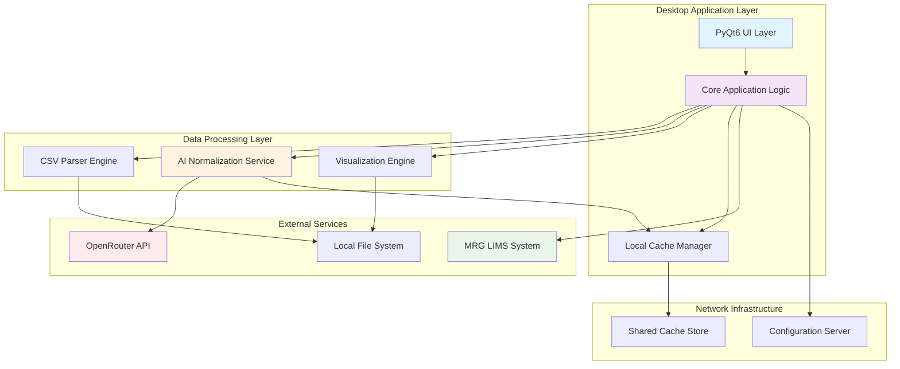

### 3.1 Architecture Principles
1. **Separation of Concerns:** Clear boundaries between UI, business logic, and data layers
2. **Modularity:** Loosely coupled components with well-defined interfaces
3. **Scalability:** Horizontal scaling through network deployment architecture
4. **Resilience:** Comprehensive error handling with graceful degradation
5. **Performance:** Asynchronous operations with intelligent caching
6. **Security:** Defense-in-depth approach with multiple security layers

---

## 4. Data Flow Architecture

### 4.1 Standard CSV Processing Workflow

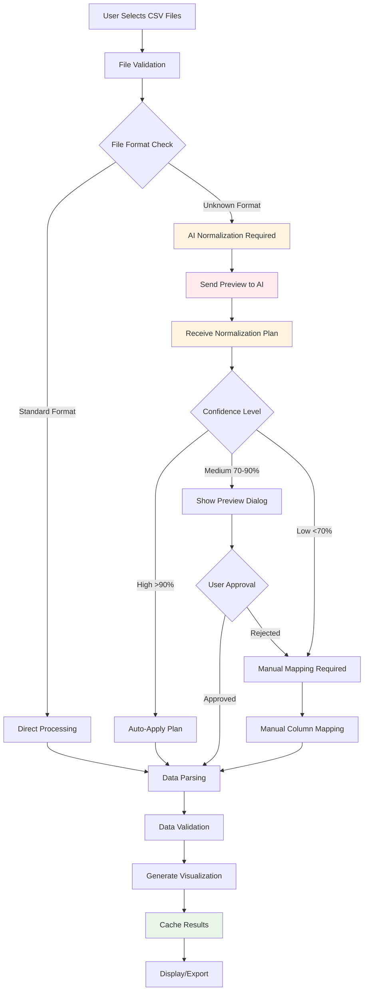

### 4.2 AI-Enhanced Processing Pipeline

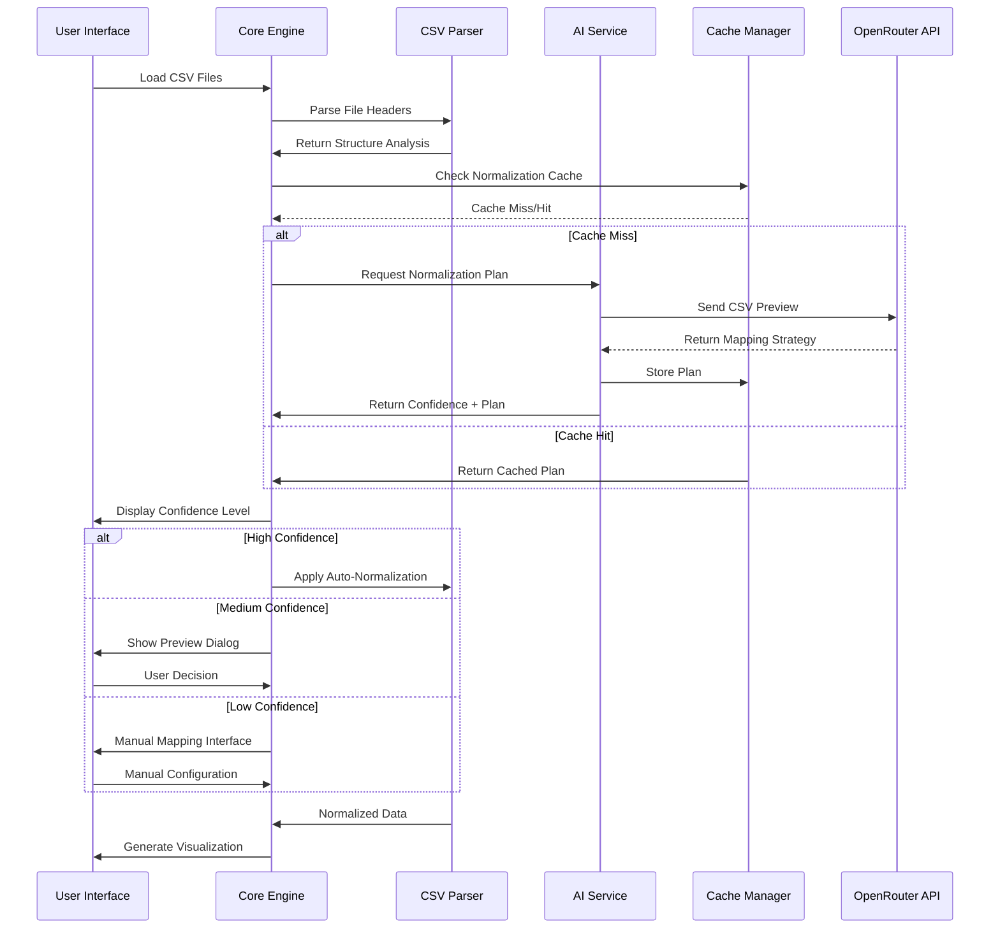

---

## 5. Core Module Structure

### 5.1 Application Architecture

```
spectral_analyzer/
├── main.py                     # Application entry point
├── config/
│   ├── __init__.py
│   ├── settings.py             # Configuration management
│   ├── security.py             # API key encryption/decryption
│   └── network.py              # Network deployment settings
├── ui/
│   ├── __init__.py
│   ├── main_window.py          # Primary application window
│   ├── components/
│   │   ├── file_manager.py     # Drag-and-drop file handling
│   │   ├── preview_panel.py    # Real-time graph preview
│   │   ├── batch_processor.py  # Batch operation controls
│   │   └── settings_dialog.py  # Configuration interface
│   └── resources/
│       ├── styles.qss          # Qt stylesheets
│       └── icons/              # Application icons
├── core/
│   ├── __init__.py
│   ├── application.py          # Main application controller
│   ├── data_manager.py         # Data flow coordination
│   └── event_system.py         # Inter-component communication
├── data/
│   ├── __init__.py
│   ├── csv_parser.py           # CSV parsing engine
│   ├── normalizer.py           # Data normalization logic
│   ├── validator.py            # Data validation rules
│   └── models.py               # Data structure definitions
├── ai/
│   ├── __init__.py
│   ├── openrouter_client.py    # OpenRouter API integration
│   ├── normalization_ai.py     # AI normalization service
│   ├── confidence_engine.py    # Confidence scoring system
│   └── prompt_templates.py     # AI prompt management
├── visualization/
│   ├── __init__.py
│   ├── graph_generator.py      # Matplotlib graph creation
│   ├── style_manager.py        # Graph styling and themes
│   └── export_manager.py       # Image export functionality
├── cache/
│   ├── __init__.py
│   ├── cache_manager.py        # Caching coordination
│   ├── file_hasher.py          # File structure hashing
│   └── redis_client.py         # Redis cache implementation
├── integration/
│   ├── __init__.py
│   ├── lims_client.py          # MRG LIMS integration
│   └── network_sync.py         # Multi-workstation synchronization
├── utils/
│   ├── __init__.py
│   ├── logging.py              # Comprehensive logging system
│   ├── error_handling.py       # Error management utilities
│   └── performance.py          # Performance monitoring
└── tests/
    ├── unit/                   # Unit test suite
    ├── integration/            # Integration test suite
    └── fixtures/               # Test data and mocks
```

### 5.2 Class Hierarchy Design

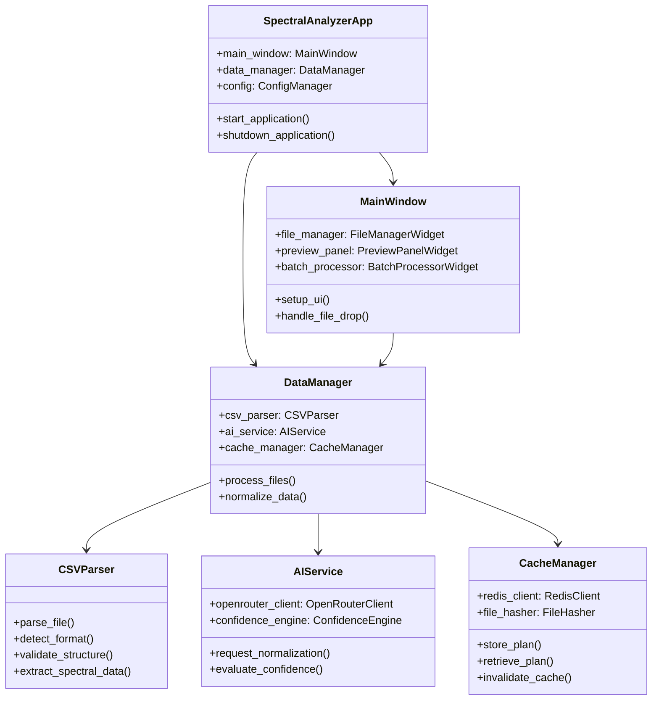

---

## 6. AI Integration Strategy

### 6.1 OpenRouter API Architecture

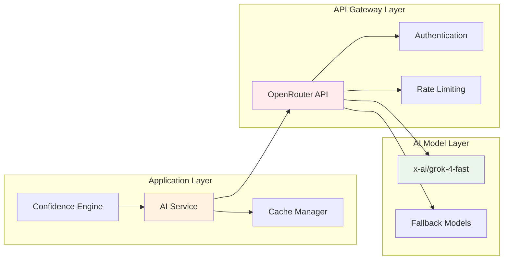

### 6.2 AI Normalization Process

**Input Preparation:**
- Extract first 50-100 rows of CSV for analysis
- Include column headers and sample data points
- Generate file structure hash for caching
- Prepare context about expected spectral data format

**Prompt Engineering:**
```python
NORMALIZATION_PROMPT = """
Analyze this CSV spectral data and provide a normalization plan:

Expected Format:
- Column 1: Wavenumber (cm⁻¹), range 400-4000, descending order
- Column 2: Absorbance, range 0.0-5.0

CSV Preview:
{csv_preview}

Provide JSON response with:
1. column_mapping: {original_column: target_column}
2. data_transformations: [list of required transformations]
3. confidence_score: 0-100
4. issues_detected: [list of potential problems]
"""
```

**Response Processing:**
- Parse JSON response with error handling
- Validate confidence score and mapping logic
- Store normalization plan in cache with file hash
- Apply confidence-based decision making

### 6.3 Confidence-Based Decision System

```python
class ConfidenceEngine:
    CONFIDENCE_THRESHOLDS = {
        'HIGH': 90,      # Auto-apply normalization
        'MEDIUM': 70,    # Show preview dialog
        'LOW': 0         # Require manual mapping
    }
    
    def evaluate_confidence(self, ai_response, file_analysis):
        base_confidence = ai_response.confidence_score
        
        # Adjust based on file characteristics
        if file_analysis.has_standard_headers:
            base_confidence += 10
        if file_analysis.data_range_valid:
            base_confidence += 5
        if file_analysis.has_missing_values:
            base_confidence -= 15
            
        return min(100, max(0, base_confidence))
```

### 6.4 API Cost Optimization

**Caching Strategy:**
- File structure hashing to identify similar CSV formats
- Normalization plan caching with 30-day TTL
- Batch processing to minimize API calls
- Preview-only analysis to reduce token usage

**Usage Tracking:**
- Monitor API calls per day/month
- Track token consumption and costs
- Alert system for budget thresholds
- Detailed usage analytics for optimization

---

## 7. User Interface Architecture

### 7.1 UI Component Hierarchy

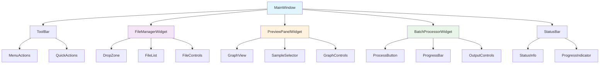

### 7.2 Modern UI Design Principles

**Visual Design:**
- Material Design 3 inspired color scheme
- Professional dark/light theme support
- Consistent iconography and typography
- Responsive layout with proper spacing

**Interaction Patterns:**
- Drag-and-drop file handling with visual feedback
- Context menus for advanced operations
- Keyboard shortcuts for power users
- Progressive disclosure for complex features

**Professional Features:**
- Customizable workspace layouts
- Dockable panels and toolbars
- Multi-monitor support
- Session state persistence

### 7.3 Real-Time Preview System

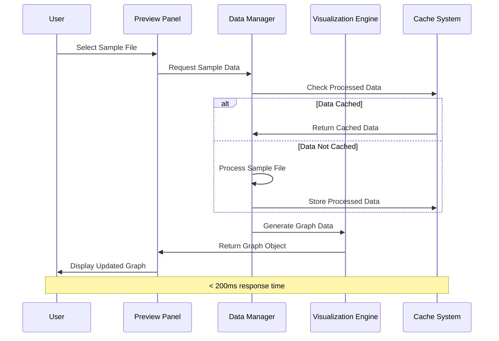

---

## 8. Caching System Architecture

### 8.1 Multi-Level Caching Strategy

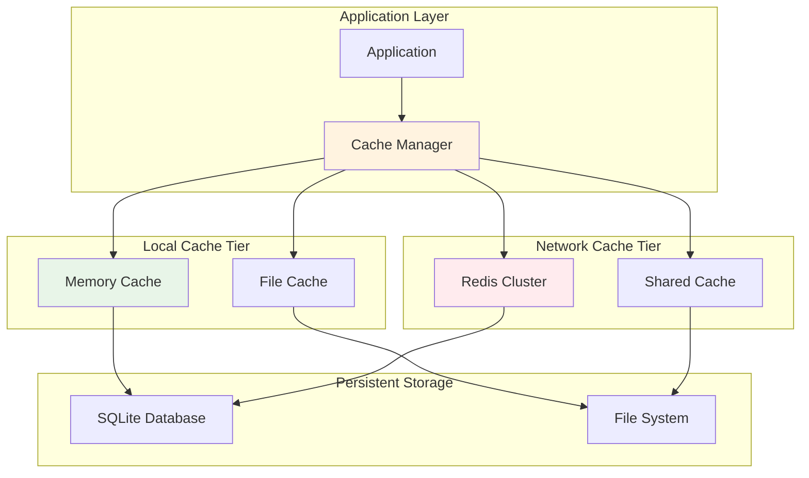

### 8.2 Cache Key Strategy

**File Structure Hashing:**
```python
def generate_file_hash(csv_file_path):
    """Generate hash based on file structure, not content"""
    with open(csv_file_path, 'r') as f:
        # Read first 100 lines for structure analysis
        preview = f.readlines()[:100]
    
    structure_info = {
        'headers': preview[0] if preview else '',
        'column_count': len(preview[0].split(',')) if preview else 0,
        'sample_rows': preview[1:6],  # First 5 data rows
        'file_size_category': get_size_category(csv_file_path)
    }
    
    return hashlib.sha256(
        json.dumps(structure_info, sort_keys=True).encode()
    ).hexdigest()
```

**Cache Hierarchy:**
1. **L1 - Memory Cache:** Recently processed data (100MB limit)
2. **L2 - Local File Cache:** Normalized CSV data (1GB limit)
3. **L3 - Network Cache:** Shared normalization plans (Redis)
4. **L4 - Persistent Cache:** Long-term storage (SQLite)

### 8.3 Cache Invalidation Strategy

**Time-Based Expiration:**
- Normalization plans: 30 days
- Processed data: 7 days
- Graph renders: 24 hours

**Event-Based Invalidation:**
- Configuration changes
- AI model updates
- Manual cache clearing
- File modification detection

---

## 9. MRG LIMS Integration

### 9.1 Integration Architecture

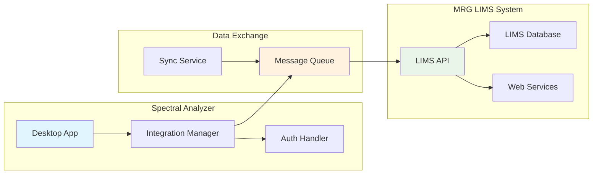

### 9.2 Data Synchronization

**Bidirectional Data Flow:**
- **Upload:** Processed spectral data, analysis results, batch reports
- **Download:** Sample metadata, baseline references, configuration updates
- **Sync:** Real-time status updates, processing notifications

**Integration Points:**
```python
class LIMSIntegration:
    def upload_analysis_results(self, batch_id, results):
        """Upload processed spectral analysis to LIMS"""
        payload = {
            'batch_id': batch_id,
            'timestamp': datetime.utcnow().isoformat(),
            'results': results,
            'metadata': self.get_processing_metadata()
        }
        return self.lims_client.post('/api/spectral/results', payload)
    
    def download_sample_metadata(self, sample_ids):
        """Retrieve sample information from LIMS"""
        return self.lims_client.get(f'/api/samples/{sample_ids}')
    
    def sync_configuration(self):
        """Synchronize application settings with LIMS"""
        config = self.lims_client.get('/api/config/spectral-analyzer')
        self.config_manager.update_from_lims(config)
```

### 9.3 Authentication & Security

**OAuth2 Implementation:**
- Secure token-based authentication
- Automatic token refresh
- Role-based access control
- Audit logging for all LIMS interactions

---

## 10. Security Architecture

### 10.1 Security Layers

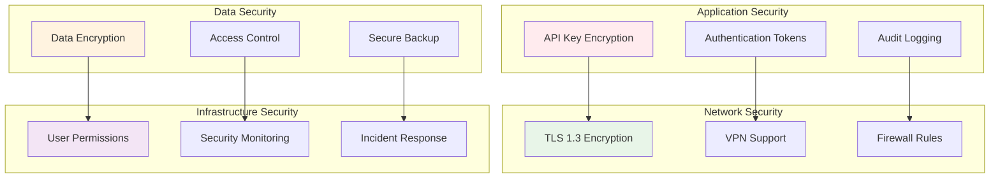

### 10.2 API Key Management

**Encryption Strategy:**
```python
class SecureKeyManager:
    def __init__(self):
        self.key_derivation = PBKDF2HMAC(
            algorithm=hashes.SHA256(),
            length=32,
            salt=self.get_machine_salt(),
            iterations=100000,
        )
    
    def encrypt_api_key(self, api_key, user_password):
        """Encrypt API key with user password + machine binding"""
        derived_key = self.key_derivation.derive(user_password.encode())
        cipher = Fernet(base64.urlsafe_b64encode(derived_key))
        return cipher.encrypt(api_key.encode())
    
    def get_machine_salt(self):
        """Generate machine-specific salt for key derivation"""
        machine_id = platform.node() + platform.machine()
        return hashlib.sha256(machine_id.encode()).digest()[:16]
```

### 10.3 Network Deployment Security

**Configuration Management:**
- Centralized configuration server with encrypted storage
- Role-based configuration access
- Automatic security updates
- Network isolation for sensitive operations

**Audit & Compliance:**
- Comprehensive audit logging
- User action tracking
- Data access monitoring
- Compliance reporting for laboratory standards

---

## 11. Performance Optimization

### 11.1 Threading Architecture

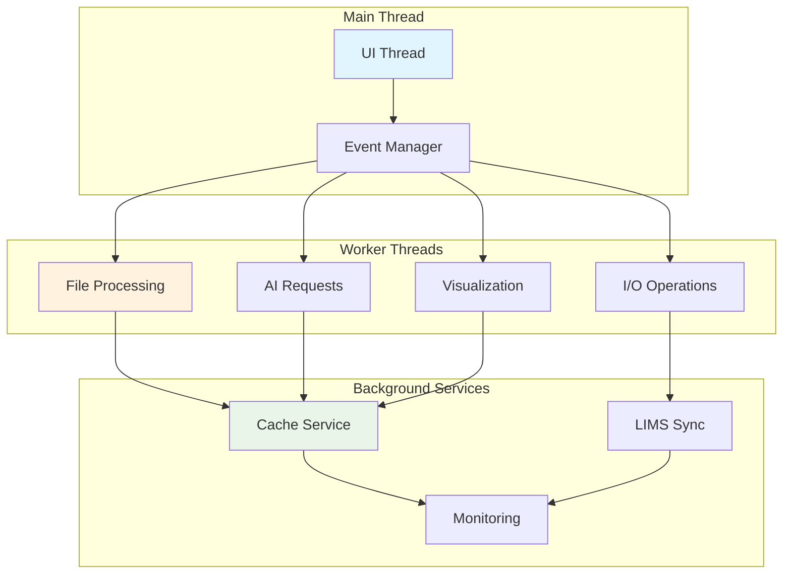

### 11.2 Asynchronous Operations

**Async Processing Pipeline:**
```python
class AsyncDataProcessor:
    async def process_batch(self, csv_files):
        """Process multiple CSV files concurrently"""
        semaphore = asyncio.Semaphore(4)  # Limit concurrent operations
        
        async def process_single_file(file_path):
            async with semaphore:
                return await self.process_csv_file(file_path)
        
        tasks = [process_single_file(f) for f in csv_files]
        results = await asyncio.gather(*tasks, return_exceptions=True)
        
        return self.handle_batch_results(results)
    
    async def ai_normalize_with_timeout(self, csv_preview):
        """AI normalization with timeout and retry logic"""
        try:
            return await asyncio.wait_for(
                self.ai_service.normalize(csv_preview),
                timeout=30.0
            )
        except asyncio.TimeoutError:
            return await self.fallback_normalization(csv_preview)
```

### 11.3 Memory Management

**Efficient Data Handling:**
- Streaming CSV processing for large files
- Lazy loading of visualization data
- Automatic memory cleanup for processed batches
- Memory-mapped file access for large datasets

**Performance Monitoring:**
```python
class PerformanceMonitor:
    def __init__(self):
        self.metrics = {
            'processing_times': [],
            'memory_usage': [],
            'api_response_times': [],
            'cache_hit_rates': []
        }
    
    @contextmanager
    def measure_operation(self, operation_name):
        start_time = time.time()
        start_memory = psutil.Process().memory_info().rss
        
        try:
            yield
        finally:
            end_time = time.time()
            end_memory = psutil.Process().memory_info().rss
            
            self.record_metrics(operation_name, {
                'duration': end_time - start_time,
                'memory_delta': end_memory - start_memory
            })
```

---

## 12. Error Handling & Resilience

### 12.1 Comprehensive Error Handling

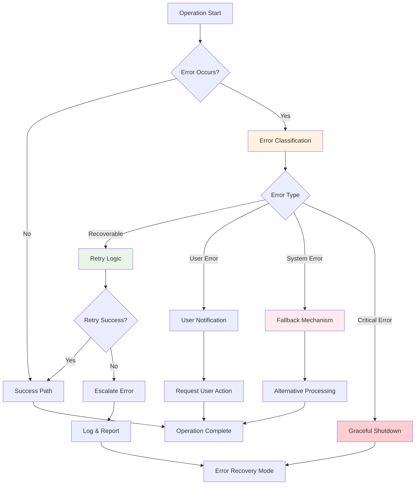

### 12.2 Fallback Mechanisms

**AI Service Fallbacks:**
1. **Primary:** OpenRouter with grok-4-fast
2. **Secondary:** Alternative OpenRouter models
3. **Tertiary:** Rule-based normalization
4. **Final:** Manual mapping interface

**Data Processing Fallbacks:**
```python
class ResilientProcessor:
    def process_csv_with_fallbacks(self, file_path):
        """Process CSV with multiple fallback strategies"""
        strategies = [
            self.ai_normalization,
            self.pattern_matching_normalization,
            self.heuristic_normalization,
            self.manual_mapping_required
        ]
        
        for strategy in strategies:
            try:
                result = strategy(file_path)
                if self.validate_result(result):
                    return result
            except Exception as e:
                self.logger.warning(f"Strategy {strategy.__name__} failed: {e}")
                continue
        
        raise ProcessingError("All normalization strategies failed")
```

### 12.3 Recovery Mechanisms

**Session Recovery:**
- Automatic session state saving
- Crash recovery with partial results
- Undo/redo functionality for user actions
- Checkpoint system for long-running operations

**Data Integrity:**
- Checksum validation for processed files
- Atomic operations for critical updates
- Backup creation before destructive operations
- Consistency checks across cache layers

---

## 13. Testing Strategy

### 13.1 Testing Pyramid

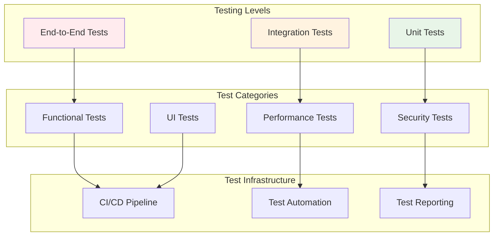

### 13.2 Test Coverage Strategy

**Unit Tests (70% of test suite):**
- CSV parsing logic
- Data normalization algorithms
- AI response processing
- Cache management
- Utility functions

**Integration Tests (25% of test suite):**
- AI service integration
- LIMS connectivity
- File system operations
- Database interactions
- Network communication

**End-to-End Tests (5% of test suite):**
- Complete workflow scenarios
- User interaction flows
- Cross-system integration
- Performance benchmarks

### 13.3 Quality Assurance Framework

**Automated Testing:**
```python
class TestSuite:
    def __init__(self):
        self.test_data_generator = TestDataGenerator()
        self.mock_services = MockServiceManager()
        self.performance_benchmarks = PerformanceBenchmarks()
    
    def run_comprehensive_tests(self):
        """Execute full test suite with reporting"""
        results = {
            'unit_tests': self.run_unit_tests(),
            'integration_tests': self.run_integration_tests(),
            'performance_tests': self.run_performance_tests(),
            'security_tests': self.run_security_tests()
        }
        
        return self.generate_test_report(results)
```

**Continuous Quality Monitoring:**
- Code coverage tracking (minimum 85%)
- Performance regression detection
- Security vulnerability scanning
- Dependency update monitoring

---

## 14. Deployment Architecture

### 14.1 Network Deployment Model

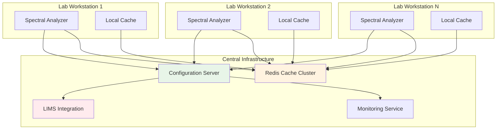

### 14.2 Installation & Configuration

**Deployment Package:**
- Self-contained installer with all dependencies
- Automatic Python environment setup
- Configuration wizard for network settings
- LIMS integration setup assistant

**Configuration Management:**
```python
class DeploymentManager:
    def setup_workstation(self, config):
        """Configure workstation for network deployment"""
        steps = [
            self.install_dependencies,
            self.setup_local_cache,
            self.configure_network_settings,
            self.test_lims_connectivity,
            self.initialize_security_settings,
            self.create_desktop_shortcuts
        ]
        
        for step in steps:
            try:
                step(config)
                self.log_success(step.__name__)
            except Exception as e:
                self.handle_setup_error(step.__name__, e)
                raise DeploymentError(f"Setup failed at {step.__name__}")
```

### 14.3 Update & Maintenance

**Automatic Updates:**
- Background update checking
- Staged rollout for critical updates
- Rollback capability for failed updates
- Configuration synchronization across workstations

**Maintenance Features:**
- Health monitoring dashboard
- Performance analytics
- Usage statistics collection
- Automated backup scheduling

---

## 15. Implementation Roadmap

### 15.1 Development Phases

**Phase 1: Core Foundation (Weeks 1-3)**
- Basic PyQt6 application structure
- CSV parsing engine implementation
- Core data models and validation
- Basic UI layout and navigation

**Phase 2: AI Integration (Weeks 4-6)**
- OpenRouter API client implementation
- AI normalization service development
- Confidence engine and decision logic
- Basic caching system

**Phase 3: Visualization & UI (Weeks 7-9)**
- Matplotlib integration and graph generation
- Real-time preview functionality
- Professional UI styling and themes
- Drag-and-drop file handling

**Phase 4: Network & Integration (Weeks 10-12)**
- LIMS integration development
- Network deployment architecture
- Multi-workstation synchronization
- Security implementation

**Phase 5: Optimization & Testing (Weeks 13-15)**
- Performance optimization
- Comprehensive testing suite
- Error handling and resilience
- Documentation and deployment guides

### 15.2 Success Metrics

**Technical Metrics:**
- Processing time: < 30 seconds for dozen CSV files
- UI responsiveness: < 200ms for preview updates
- Cache hit rate: > 80% for normalization plans
- API cost efficiency: < $10/month per workstation

**Quality Metrics:**
- Test coverage: > 85%
- Bug density: < 1 bug per 1000 lines of code
- User satisfaction: > 4.5/5 rating
- System uptime: > 99.9%

---

## 16. Risk Assessment & Mitigation

### 16.1 Technical Risks

| Risk | Probability | Impact | Mitigation Strategy |
|------|-------------|--------|-------------------|
| AI API Rate Limits | Medium | High | Intelligent caching, fallback models |
| CSV Format Variations | High | Medium | Comprehensive parser, AI normalization |
| Network Connectivity Issues | Medium | Medium | Offline mode, local caching |
| Performance Bottlenecks | Medium | High | Async processing, optimization |
| LIMS Integration Complexity | High | High | Phased integration, extensive testing |

### 16.2 Business Risks

| Risk | Probability | Impact | Mitigation Strategy |
|------|-------------|--------|-------------------|
| Budget Overrun (API Costs) | Medium | High | Cost monitoring, usage optimization |
| Timeline Delays | Medium | Medium | Agile development, MVP approach |
| User Adoption Resistance | Low | High | User training, intuitive design |
| Competitor Solutions | Low | Medium | Unique AI features, LIMS integration |

---

## 17. Conclusion

This comprehensive technical architecture provides a robust foundation for developing a production-ready AI-powered spectral analysis desktop application. The architecture addresses all key requirements while ensuring scalability, maintainability, and professional-grade quality.

### Key Architectural Strengths:
1. **Modular Design:** Clean separation of concerns enables independent development and testing
2. **AI Integration:** Intelligent normalization with confidence-based decision making
3. **Performance Optimization:** Multi-threaded processing with intelligent caching
4. **Network Deployment:** Scalable architecture supporting multiple lab workstations
5. **Professional UI:** Modern interface comparable to commercial software
6. **Comprehensive Testing:** Quality assurance framework ensuring reliability
7. **Security Focus:** Enterprise-grade security for API keys and data protection

### Expected Outcomes:
- **Development Time:** 15 weeks with 2-3 developers
- **Performance:** Sub-30-second processing for typical batch operations
- **Cost Efficiency:** < $10/month API costs per workstation
- **User Experience:** Professional-grade interface with intuitive workflows
- **Reliability:** 99.9% uptime with comprehensive error handling

This architecture positions the application to win the Schneider Prize while delivering genuine value to MRG Labs' spectroscopy workflow automation needs.